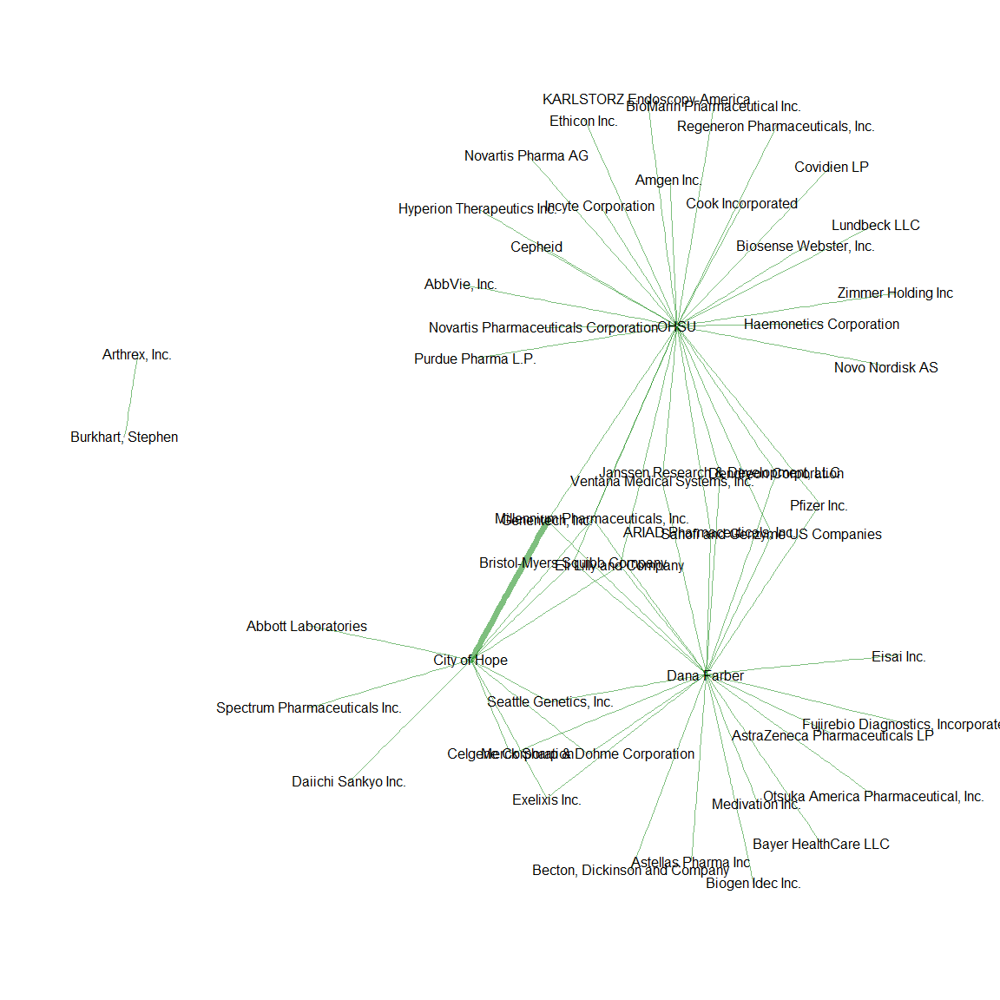

# CMS Open Payments
Benjamin Chan (chanb@ohsu.edu)  
  
**Play around with the CMS [Open Payments](http://www.cms.gov/OpenPayments) data.**
  
2014-10-03 15:51:37

R version 3.1.1 (2014-07-10)


# Get the data

Run the script to read the data.
Hide the code and the output since it's under version control on [GitHub](https://github.com/benjamin-chan/OpenPayments).
Also, source a function library.


```r
setwd(file.path("~", "GitHub Repositories", "OpenPayments"))
source("library.r")
source("getData.r")
```

Use [OpenRefine](http://openrefine.org/) to clean the data.
This requires an interactive session of OpenRefine.


# Mapping payments

**Which states received the most payments?**
Map payments at the state level.


```r
DAgg <- D[,
          list(value = sum(Total_Amount_of_Payment_USDollars) / 1E6,
               region = Recipient_State),
          list(Recipient_State)]
require(choroplethr)
choroplethr(DAgg, 
            lod="state", 
            title="General + Research Payments")
```

 


# Network of payers and recipients


## Select recipients

The network of payers and recipients is huge.
Narrow the focus to **include only the following recipients**

* OHSU
* City of Hope National Medical Center
* Dana Farber Cancer Institute
* Burkhart, Stephen

Further narrow the focus to **include payers who made more than $10,000 in payments** to those recipients.


```r
DAgg <- D[,
          list(sumAmt = sum(Total_Amount_of_Payment_USDollars)),
          list(payer, recipient)]
regex <- "OREGON HEALTH|CITY OF HOPE|DANA FARBER|BURKHART, STEPHEN"
DSubset <- DAgg[grepl(regex, toupper(recipient))]
DSubset <- DSubset[grep("OREGON HEALTH", toupper(recipient)), recipient := "OHSU"]
DSubset <- DSubset[grep("CITY OF HOPE", toupper(recipient)), recipient := "City of Hope"]
DSubset <- DSubset[grep("DANA FARBER", toupper(recipient)), recipient := "Dana Farber"]
DSubset <- DSubset[grep("BURKHART, STEPHEN", toupper(recipient)), recipient := "Burkhart, Stephen"]
DSubset <- DSubset[,
                   list(sumAmt = sum(sumAmt)),
                   list(payer, recipient)]
DSubset <- DSubset[sumAmt > 1E4]
DSubset <- DSubset[order(recipient, payer)]
DSubset[, list(sumAmtMillions = sum(sumAmt) / 1E6), recipient]
```

```
##            recipient sumAmtMillions
## 1: Burkhart, Stephen          7.353
## 2:      City of Hope        124.188
## 3:       Dana Farber         15.998
## 4:              OHSU          5.322
```

```r
require(igraph)
G <- graph.data.frame(DSubset, directed=FALSE)
V(G)$size <- 0
V(G)$color <- "grey"
E(G)$width <- scale(DSubset$sumAmt, center=FALSE, scale=TRUE)
E(G)$color <- rgb(0, 128, 0, 128, maxColorValue=255)
plot(G,
     vertex.label.color="black",
     vertex.label.family="sans",
     vertex.frame.color=NA)
```

 


## Big payments

Include payment of more than $100,000.

Create a graph for the entire network.


```r
D[, 
  list(n = .N,
       sumAmtMillions = sum(Total_Amount_of_Payment_USDollars) / 1E6), 
  amtCategory][, 
               list(amtCategory,
                    amtLevel = unclass(amtCategory),
                    n,
                    pct = n / sum(n) * 100,
                    sumAmtMillions,
                    pctSumAmt = sumAmtMillions / sum(sumAmtMillions) * 100)][order(amtCategory)]
```

```
##      amtCategory amtLevel       n       pct sumAmtMillions pctSumAmt
## 1:         [0,1]        1   26370  0.995132        0.01548  0.001876
## 2:        (1,10]        2  350800 13.238240        1.90645  0.230980
## 3:      (10,100]        3 1909672 72.065841       45.32137  5.490988
## 4:   (100,1e+03]        4  263388  9.939549       71.76997  8.695412
## 5: (1e+03,1e+04]        5   93330  3.522021      237.74564 28.804477
## 6: (1e+04,1e+05]        6    5704  0.215253      153.77947 18.631413
## 7: (1e+05,1e+06]        7     571  0.021548      136.01983 16.479714
## 8: (1e+06,1e+07]        8      64  0.002415      178.81917 21.665141
```

```r
DAgg <- D[Total_Amount_of_Payment_USDollars > 1E5,
          list(sumAmtMillions = sum(Total_Amount_of_Payment_USDollars) / 1E6),
          list(payer, recipient)]
DAgg <- DAgg[,
             `:=` (sumAmtCategory = cut(sumAmtMillions, c(1E-1, 1E0, 1E1, 1E2, 1E3), include.lowest=TRUE),
                   sumAmtScaled = scale(sumAmtMillions, center=FALSE, scale=TRUE))]
DAgg[,
     list(n = .N,
          sumAmtMillions = sum(sumAmtMillions)),
     sumAmtCategory][order(sumAmtCategory)]
```

```
##    sumAmtCategory   n sumAmtMillions
## 1:        [0.1,1] 357         102.31
## 2:         (1,10]  38          90.68
## 3:    (100,1e+03]   1         121.85
```

```r
vertices <- rbind(unique(DAgg[, list(name = payer, type = "Payer")]),
                  unique(DAgg[, list(name = recipient, type = "Recipient")]))
G <- graph.data.frame(DAgg, vertices=vertices, directed=TRUE)
V(G)$size <- 0
V(G)$color <- ifelse(V(G)$type == "Payer", "red", "black")
E(G)$color <- rgb(0, 128, 0, 128, maxColorValue=255)
E(G)$weight <- unclass(DAgg$sumAmtCategory)
E(G)$width <- unclass(DAgg$sumAmtCategory)
```

Plot the network.
Get the file at [./OpenPayments_files/figure-html/networkBigPayments.png](https://github.com/benjamin-chan/OpenPayments/blob/master/OpenPayments_files/figure-html/networkBigPayments.png) for the full effect.


```r
plot(as.undirected(G),
     vertex.label.cex=1,
     vertex.label.color=V(G)$color,
     vertex.label.family="sans",
     vertex.frame.color=NA)
```

 

Write GraphML dataset for use in [Gephi](http://gephi.github.io/).


```r
write.graph(G, file.path(getwd(), "openpayments.graphml"), format="graphml")
```
